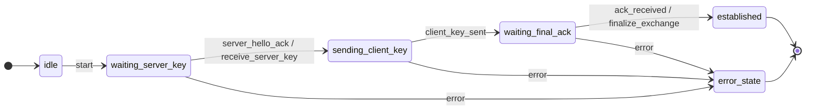
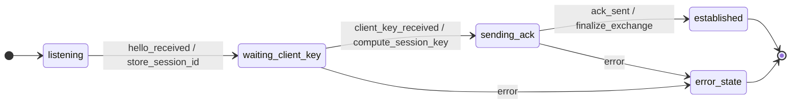

```mermaid
stateDiagram-v2
  direction LR

  [*] --> idle
  established --> [*]
  error_state --> [*]

  idle --> waiting_server_key : start
  waiting_server_key --> sending_client_key : server_hello_ack / receive_server_key
  waiting_server_key --> error_state : error
  sending_client_key --> waiting_final_ack : client_key_sent
  sending_client_key --> error_state : error
  waiting_final_ack --> established : ack_received / finalize_exchange
  waiting_final_ack --> error_state : error
```

---
title: KeyExchangeServer
---

```mermaid
stateDiagram-v2
  direction LR

  [*] --> listening
  established --> [*]
  error_state --> [*]

  listening --> waiting_client_key : hello_received / store_session_id
  waiting_client_key --> sending_ack : client_key_received / compute_session_key
  waiting_client_key --> error_state : error
  sending_ack --> established : ack_sent / finalize_exchange
  sending_ack --> error_state : error
```
